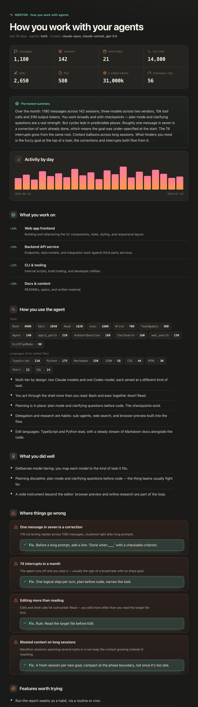

# mentor

**mentor** is a skill for AI coding agents: Claude Code, Codex, and any other agent that reads the SKILL.md format. The skill reads your own local session history and writes one self-contained HTML report on how you actually work: what you build, where you lose time, and the exact changes that make you faster. It is a session-insights skill modeled on Claude Code's built-in `/insights`, pointed at the one part of the loop you never instrument, yourself.

Agents now do the work juniors used to. But juniors became seniors by getting feedback from seniors. Give agents to juniors and retire the seniors, and that feedback loop disappears. This skill is that loop, packaged as an agent skill you install once and run every week.



## What the skill does

- **Reads your local session history.** Claude Code transcripts under `~/.claude` and Codex rollouts under `~/.codex`. Nothing is uploaded; the skill runs entirely on your machine.
- **Aggregates many sessions** into headline numbers (messages, sessions, tool calls, edits, files touched, tokens) plus per-day activity, tool mix, and languages.
- **Writes one self-contained `report.html`** with eight sections, inline SVG icons, count-up numbers, and an animated chart. No dependencies and no build step, so any browser opens it.

| Section | What it gives you |
|---|---|
| What you work on | Your sessions clustered into themes, with rough share |
| How you use the agent | Tool ratios, languages, model tiering, checkpoints |
| What you did well | Real wins, handed back |
| Where things go wrong | Friction points, each with evidence and a concrete fix |
| Features worth trying | Capabilities you under-use |
| Suggested CLAUDE.md additions | Copy-paste lines that kill a recurring friction |
| New ways to use it | Better workflows for your patterns |
| On the horizon | Where your workflow is heading |

The friction section is the point of the skill: every friction names a repeatable fix, a CLAUDE.md line, a hook, or a habit, so the same mistake stops showing up next week.

## Install the skill

Recommended, via [skills.sh](https://skills.sh), the open marketplace for agent skills. One command installs the skill into any supported agent:

```bash
npx skills add smixs/mentor
```

Useful flags:

```bash
# globally, for every project
npx skills add smixs/mentor -g

# into specific agents
npx skills add smixs/mentor -a claude-code -a codex

# no questions, for CI
npx skills add smixs/mentor -g -y
```

Update the skill to the latest version: `npx skills update mentor`.

**Manual (Claude Code)** clones the skill straight into your skills directory:

```bash
git clone https://github.com/smixs/mentor.git ~/.claude/skills/mentor
```

For Codex, clone the skill into `~/.codex/skills/mentor` instead. The bundled scripts need [`uv`](https://github.com/astral-sh/uv); the skill itself is plain Markdown that any skills-capable agent can read.

## Use the skill

Run the command, or just ask the agent for it in your own words ("review how I work with the agent", "разбери мои сессии"):

```
/mentor            # both agents, last 30 days (default)
/mentor claude     # Claude Code sessions only
/mentor codex      # OpenAI Codex sessions only
/mentor both       # cross-agent read: habits that show up in both tools
```

Add a window with `--days N`. The skill writes the report to `~/.claude/usage-data/mentor-report.html` and opens it. Make the skill a weekly habit, since the patterns show up over runs, not in a single one:

```bash
claude -p "/mentor both"
```

## How the skill works

Three small scripts, no magic:

1. **`collect.py`** parses every session in the window into one stats bundle. The numbers are counted, not guessed.
2. The agent reads that digest and writes the eight-section analysis, grounded in your actual prompts and metrics.
3. **`render_report.py`** merges stats and analysis into the final HTML.

The report is written in your language (English by default; Russian chrome is built into the skill). Some judgments, like themes and satisfaction, are model-inferred and flagged as such; read them as hypotheses, not verdicts.

## Privacy

The skill reads local log files and writes a local HTML file. Your transcripts never leave your machine.

## License

MIT, see [LICENSE](LICENSE). Русская версия: [README.ru.md](README.ru.md).
